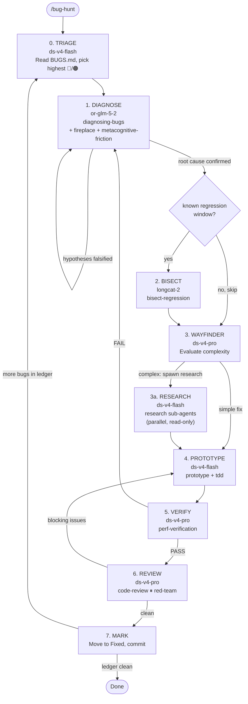

# Bug Hunt

Systematic bug-fixing pipeline against the project bug ledger (`.scratch/BUGS.md`). Each stage delegates to a specialized skill. Stages run sequentially — exit criteria must be met before advancing.

## Pipeline Stages



**Three loops:**
- **Diagnose ↻ Diagnose** — falsified hypotheses → re-form, re-instrument
- **Verify ↺ Diagnose** — fix didn't work → restart diagnosis with new evidence
- **Review ↺ Prototype** — blocking review issues → re-fix

**One outer loop:**
- **Mark → Triage** — after fixing one bug, pick the next from the ledger. Stops when ledger is clean.

### Stage 0 — Triage

Read `.scratch/BUGS.md`. Pick the highest-severity unresolved bug (🔴 > 🟠 > 🟡 > 🟢). If no bugs remain, report "ledger clean."

**Output:** Bug ID, description, affected files, reproduction steps from BUGS.md.

**Exit:** Bug selected with clear repro command.

### Stage 1 — Diagnose

Delegate to `diagnosing-bugs` skill. Build the feedback loop per its Phase 1-4:

1. **Build feedback loop** — a single deterministic command that goes red on this bug. Use the repro from BUGS.md as a starting point. Use `llama-server` (not `llama-cli`) to avoid infinite spinner loops on garbled output.
2. **Reproduce + minimise** — confirm the bug, shrink the repro.
3. **Hypothesise** — generate 3-5 ranked falsifiable hypotheses. Use `fireplace` if stuck in a single frame. Use `metacognitive-friction` to de-bias before committing to a theory.
4. **Instrument** — add targeted `fprintf(stderr, "[DEBUG-XXXX] ...")` probes. One variable at a time. Tag every debug log with a unique prefix.

**Output:** Confirmed root cause + target file + target line(s) for the fix.

**Exit:** Root cause is falsifiable and confirmed by instrumentation output.

### Stage 2 — Bisect (OPTIONAL)

If the bug appeared between two known git commits and the exact breaking change is unknown, delegate to `bisect-regression` skill. Skip if root cause is already clear from Stage 1.

**Output:** First bad commit + diff or "bisect skipped — root cause already confirmed."

### Stage 3 — Wayfinder (Complexity Triage)

After root cause is confirmed, evaluate whether the fix path is straightforward or needs deeper study. Delegate to a Wayfinder sub-agent.

**Simple fix** (≤5 lines, 1 file, obvious from root cause): skip directly to Prototype.

**Complex fix** (multiple files, structural change, unclear side effects): spawn `research` sub-agents in parallel to study the affected code paths, call sites, and potential regressions. Research is read-only — no code changes.

Use `fireplace` if the attack surface is unclear. Use `metacognitive-friction` to challenge the root-cause hypothesis before committing to a fix strategy.

**Output:** Fix plan: target files, expected change size, known risks. Research reports at `.scratch/research/<bug-id>-research-*.md` if complex.

**Exit:** Fix plan is clear enough to implement.

### Stage 4 — Prototype

Delegate fix to a worktree-isolated sub-agent using the `prototype` skill pattern:

1. Implement minimal fix (≤10 lines, ≤2 files).
2. Build with `cmake --build <build_dir> --target llama-server -j$(nproc)`.
3. Test with ≥3 prompts on ≥2 model configs using `llama-server`.
4. Check: coherent output, no looping, no garbled tokens.

**Output:** Code diff + PASS/FAIL verdict.

**Exit:** All test prompts produce coherent, semantically correct output.

### Stage 5 — Verify

Delegate to `perf-verification` skill. Run the full verification gate:

- 2+ models, 3+ prompts each
- Coherence check (English output for English prompts, correct facts)
- Throughput measurement (tg t/s, pp t/s)
- Comparison against pre-fix baseline from BUGS.md or AGENTS.md

**Output:** Verification report at `.scratch/benchmarks/<bug-id>-verify.md` with PASS/FAIL.

**Exit:** All configurations PASS coherence + no throughput regression.

### Stage 6 — Review

Run two parallel reviews:

1. `code-review` — Standards (coding conventions) + Spec (matches root cause, doesn't break other paths).
2. `red-team` — Adversarial review. Attack the fix: what could still go wrong? What edge cases are untested? What assumptions does the fix make?

**Output:** Review report at `.scratch/code-review/<bug-id>-review.md`.

**Exit:** No blocking issues. If blocking issues found → back to Stage 4 (Prototype).

### Stage 7 — Mark BUGS.md

Update `.scratch/BUGS.md`:
- Move bug from "Active Bugs" to "Fixed Bugs"
- Add fix commit hash, date, root cause, verification result
- If fix is partial (workaround, not root cause), note limitations

Commit the fix with a conventional commit message referencing the bug ID.

**If more unresolved bugs remain in the ledger:** return to Stage 0 (Triage) and repeat the pipeline.

**If ledger is clean:** report "all bugs resolved" and stop.

## Skill Map

| Stage | Primary Skill | Backup / Enhancer |
|-------|--------------|-------------------|
| Triage | (direct read) | — |
| Diagnose | `diagnosing-bugs` | `fireplace`, `metacognitive-friction` |
| Bisect | `bisect-regression` | — |
| Wayfinder | `wayfinder-assembly-chain` | `fireplace`, `metacognitive-friction` |
| Research | `research` | — |
| Prototype | `prototype` | `tdd` |
| Verify | `perf-verification` | — |
| Review | `code-review` | `red-team` |
| Mark | (direct write) | — |

## Rules

1. **Never skip stages.** Each stage has an exit criterion. Advance only when met.
2. **Never fix without a feedback loop.** If the diagnose stage can't build a red-capable loop, escalate — don't guess.
3. **One bug at a time.** Finish the pipeline before starting the next bug.
4. **Document everything.** Every stage writes its output to `.scratch/`. Failed hypotheses are valuable — keep them.
5. **llama-server, not llama-cli.** The spinner/loop bug in llama-cli makes it unsuitable for automated testing. Always use `llama-server` with `--no-warmup -c 128` and curl-based prompt testing.
6. **GPU lease required** for any stage that touches GPU. Use `gpu-lease` skill.

## Model Selection

Each stage has different compute and reasoning demands. The orchestrator picks the model per sub-agent dispatch:

| Stage | Recommended Model | Why |
|-------|------------------|-----|
| Triage | `ds-v4-flash` | Fast, cheap — just reads BUGS.md and picks priority |
| Diagnose | `or-glm-5-2` | 1M context window, high-IQ reasoning for reading source files, forming hypotheses, instrumenting code |
| Bisect | `longcat-2` | Efficient execution — runs git bisect, builds, tests |
| Wayfinder | `ds-v4-pro` | Evaluates fix complexity, decides simple vs research path |
| Research | `ds-v4-flash` | Fast parallel read-only code study |
| Prototype | `ds-v4-flash` | Fast code generation — writes minimal targeted fixes |
| Verify | `ds-v4-pro` | Thorough — runs GPU benchmarks, checks coherence, compares baselines |
| Review | `ds-v4-pro` | Deep code analysis — Standards + Spec axes, adversarial review |

**Override with `--model <name>`** to force a specific model for all stages, or `--model-stage <stage>:<model>` for per-stage override:

```
/bug-hunt --model or-glm-5-2                          # all stages use GLM 5.2
/bug-hunt --model-stage diagnose:grok-4.5              # diagnose uses Grok, rest default
/bug-hunt --model-stage prototype:or-qwen3-coder-free  # cheaper prototype model
```

The orchestrator passes these to `spawn_subagent(model=...)` for each stage dispatch.

## Quick Start

```
/bug-hunt                  # pick highest-severity bug from BUGS.md and run pipeline
/bug-hunt BUG-003          # hunt a specific bug
/bug-hunt --triage-only    # just show the triage output, don't proceed
```

## Integration with wayfinder-assembly-chain

For multi-bug campaigns, the `wayfinder-assembly-chain` skill can orchestrate multiple `bug-hunt` runs in parallel (different bugs in isolated worktrees). The parent Wayfinder re-evaluates after each batch and re-prioritizes the ledger.
