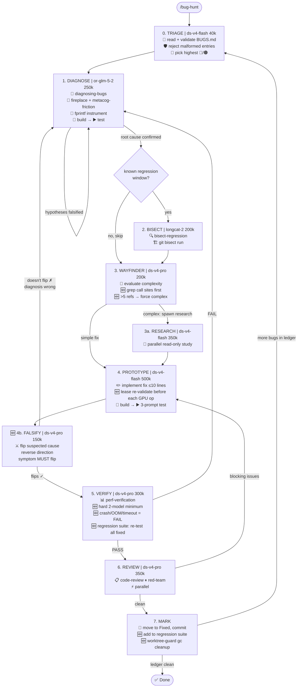

# Bug Hunt

Systematic bug-fixing pipeline against the project bug ledger (`.scratch/BUGS.md`). Each stage delegates to a specialized skill. Stages run sequentially — exit criteria must be met before advancing.

## Pipeline Stages



**Four loops:**
- **Diagnose ↻ Diagnose** — falsified hypotheses → re-form, re-instrument
- **Falsify ↺ Diagnose** — flipped cause didn't change symptom → diagnosis was wrong
- **Verify ↺ Diagnose** — fix didn't work → restart diagnosis with new evidence
- **Review ↺ Prototype** — blocking review issues → re-fix

**One outer loop:**
- **Mark → Triage** — after fixing one bug, pick the next from the ledger. Stops when ledger is clean.

### Stage 0 — Triage

Read `.scratch/BUGS.md`. **Validate the schema** before picking a bug:
- Every entry must have: `Severity`, `Discovered`, `Symptom`, `Reproduction`, `Status`
- Severity must **start with** one of: `🔴 Critical`, `🟠 High`, `🟡 Medium`, `🟢 Low` (may have ` — description` appended)
- Status must be `Open` (skip `Blocked`, `Fixed`)
- If any entry fails validation, report "BUGS.md has N malformed entries" and **refuse to proceed** until fixed.

**Reproduction command canonicalization:** BUGS.md repro commands may use `llama-server -p` shorthand. The Diagnose stage must translate these to the canonical `llama-server` + `curl` format:

```
# BAD (llama-server doesn't accept -p/-n):
./llama-server -m model.gguf -ngl 0 -p "Hello" -n 5

# GOOD (canonical):
./llama-server -m model.gguf -ngl 0 --port <random> --no-webui --no-warmup -c 64 &
sleep 3
curl -s http://127.0.0.1:<port>/v1/completions -H "Content-Type: application/json" \
  -d '{"prompt":"Hello","max_tokens":5,"temperature":0}'
kill %1
```

Pick the highest-severity unresolved bug (🔴 > 🟠 > 🟡 > 🟢). If no bugs remain, report "ledger clean."

**Hardware requirements check:** Before selecting a bug, verify the pipeline can satisfy its hardware needs. If the bug requires multi-GPU, RPC servers, specific GPU types, or models that don't fit in available VRAM, and those resources aren't available, skip the bug and pick the next highest severity. Report skipped bugs with reason.

**Output:** Bug ID, description, affected files, reproduction steps, required hardware (from BUGS.md or inferred).

**Output:** Bug ID, description, affected files, reproduction steps from BUGS.md.

**Exit:** Bug selected with clear repro command + BUGS.md schema valid.

### Stage 1 — Diagnose

Delegate to `diagnosing-bugs` skill. Build the feedback loop per its Phase 1-4:

1. **Build feedback loop** — a single deterministic command that goes red on this bug. Use the repro from BUGS.md as a starting point. Use `llama-server` (not `llama-cli`) to avoid infinite spinner loops on garbled output.
2. **Reproduce + minimise** — confirm the bug, shrink the repro.
3. **Hypothesise** — generate 3-5 ranked falsifiable hypotheses. Use `fireplace` if stuck in a single frame. Use `metacognitive-friction` to de-bias before committing to a theory.
4. **Instrument** — add targeted `fprintf(stderr, "[DEBUG-XXXX] ...")` probes. One variable at a time. Tag every debug log with a unique prefix.

**Output:** Confirmed root cause + target file + target line(s) for the fix. **Must include exact symbol names** (function names, struct fields, variable names) so the Wayfinder can grep call sites without re-discovery.

**Exit:** Root cause is falsifiable and confirmed by instrumentation output.

### Stage 2 — Bisect (OPTIONAL)

If the bug appeared between two known git commits and the exact breaking change is unknown, delegate to `bisect-regression` skill. Skip if root cause is already clear from Stage 1.

**Output:** First bad commit + diff or "bisect skipped — root cause already confirmed."

### Stage 3 — Wayfinder (Complexity Triage)

After root cause is confirmed, evaluate whether the fix path is straightforward or needs deeper study. Delegate to a Wayfinder sub-agent.

**Before classifying as "simple", grep for call sites:**
1. For every function/struct/symbol in the target fix area, run `grep -rn '<symbol>' --include='*.cpp' --include='*.cu' --include='*.h'` in the source tree.
2. Count unique references across files.
3. **If >5 call sites or >2 files reference the target:** classify as **complex** regardless of fix size. Hidden coupling kills simple fixes.
4. If ≤5 call sites, all in the same file as the fix: may classify as simple.

**Simple fix** (≤5 lines, ≤1 file, ≤5 call sites, obvious from root cause): skip directly to Prototype.

**Complex fix** (multiple files, structural change, >5 call sites, unclear side effects): spawn `research` sub-agents in parallel to study the affected code paths, call sites, and potential regressions. Research is read-only — no code changes.

Use `fireplace` if the attack surface is unclear. Use `metacognitive-friction` to challenge the root-cause hypothesis before committing to a fix strategy.

**Output:** Fix plan: target files, expected change size, known risks, call-site count. Research reports at `.scratch/research/<bug-id>-research-*.md` if complex.

**Exit:** Fix plan is clear enough to implement with call-site map.

### Stage 4 — Prototype

Delegate fix to a worktree-isolated sub-agent using the `prototype` skill pattern:

1. Implement minimal fix (≤10 lines, ≤2 files).
2. Build with `cmake --build <build_dir> --target llama-server -j$(nproc)`.
3. Test with ≥3 prompts on ≥2 model configs using `llama-server`.
4. Check: coherent output, no looping, no garbled tokens.

**Lease re-validation:** Before every GPU operation (build, test run), re-validate the GPU lease. If the lease was lost (timeout, preemption), fail the stage explicitly — do not silently race another agent on the same GPU.

**Output:** Code diff + PASS/FAIL verdict.

**Exit:** All test prompts produce coherent, semantically correct output.

### Stage 4b — Falsify (🆕 HARDENING)

**Critical:** Before Verify, prove the diagnosis is correct by flipping the suspected cause.

1. Take the confirmed root cause from Stage 1.
2. **Deliberately make it worse** using a strategy that matches the bug type:

| Bug Type | Falsification Strategy |
|----------|----------------------|
| Buffer race / timing | Widen the race window: double buffer, add sleep between operations |
| Wrong dimension / shape | Multiply the wrong dimension by 2, or swap rows/cols |
| Incorrect condition / flag | Invert the condition (`if (x)` → `if (!x)`) |
| Missing initialization | Zero-fill before use instead of after |
| Wrong backend placement | Force to opposite backend (GPU↔CPU) |
| Logic / algorithm error | Apply the inverse operation, or skip the fix entirely |

3. Run the feedback loop from Stage 1.
   - **If the symptom gets worse:** the diagnosis is correct → advance to Verify.
   - **If the symptom does NOT change:** the diagnosis is wrong → **restart at Stage 1 (Diagnose)**.
   - **If no clear strategy applies:** document `"falsify-skipped: no reversible cause"` and advance to Verify with a warning.

4. **Revert** the falsification change after the test.

**Output:** Falsification result: symptom amplified (✓), unchanged (✗ → restart), or skipped (⚠️ advance with warning).

**Exit:** Symptom amplified — root cause confirmed by negative test.

### Stage 5 — Verify

Delegate to `perf-verification` skill. Run the full verification gate:

**Hard minimum: 2 models, 3+ prompts each.** If any model fails to produce results — crash, OOM, timeout, RPC disconnect — that is a **FAIL**, not a skip.

- 2+ models, 3+ prompts each (enforced minimum)
- Coherence check (English output for English prompts, correct facts)
- Throughput measurement (tg t/s, pp t/s)
- Comparison against pre-fix baseline from BUGS.md or AGENTS.md

**Regression suite (🆕 HARDENING):** Before testing the current bug, run the verification commands for **all previously fixed bugs** from `.scratch/regression-suite.json`. If the file doesn't exist (first run, no prior fixes), skip — this is not an error. If any previously fixed bug regresses, this is a **FAIL** — the current fix broke a prior fix. Do not commit.

**Baseline handling:** If BUGS.md doesn't specify a pre-fix throughput baseline, measure current throughput and document it in the verification report as the new baseline. Don't block on missing baselines — correctness bugs (garbled output) don't need throughput comparison.

**Output:** Verification report at `.scratch/benchmarks/<bug-id>-verify.md` with PASS/FAIL including regression suite results.

**Exit:** All configurations PASS coherence + no throughput regression + all regression tests pass.

### Stage 6 — Review

Run two parallel reviews:

1. `code-review` — Standards (coding conventions) + Spec (matches root cause, doesn't break other paths).
2. `red-team` — Adversarial review. Attack the fix: what could still go wrong? What edge cases are untested? What assumptions does the fix make?

**Output:** Review report at `.scratch/code-review/<bug-id>-review.md`.

**Exit:** No blocking issues. If blocking issues found → back to Stage 4 (Prototype).

### Stage 7 — Mark BUGS.md

Update `.scratch/BUGS.md`:
- Move bug from "Active Bugs" to "Fixed Bugs"
- Add fix commit hash, date, root cause, verification result
- If fix is partial (workaround, not root cause), note limitations

Commit the fix with a conventional commit message referencing the bug ID.

**Add to regression suite (🆕 HARDENING):** Append this bug's verification commands (Stage 5 test invocations) to `.scratch/regression-suite.json`. Future bug fixes will re-run these tests to detect regressions.

**Task-state archive (🆕):** Before pruning the task state file, extract the `findings` and `artifacts` fields and append them to `.scratch/bug-hunt-resolved.jsonl` as a permanent record. The state file is pruned, but the diagnosis and fix evidence survive.

**Worktree GC (🆕 HARDENING):** Run `worktree-guard gc` to cross-reference `.scratch/task-state/` with existing worktrees. Remove any orphaned worktrees and branches not associated with an active task state.

**If more unresolved bugs remain in the ledger:** return to Stage 0 (Triage) and repeat the pipeline.

**If ledger is clean:** report "all bugs resolved" and stop.

## Skill Map

| Stage | Primary Skill | Backup / Enhancer |
|-------|--------------|-------------------|
| Triage | (direct read + validate) | `task-state` |
| Diagnose | `diagnosing-bugs` | `fireplace`, `metacognitive-friction`, `task-state` |
| Bisect | `bisect-regression` | `task-state` |
| Wayfinder | `wayfinder-assembly-chain` | `fireplace`, `metacognitive-friction`, `task-state` |
| Research | `research` | — |
| Prototype | `prototype` | `tdd`, `worktree-guard`, `task-state` |
| **🆕 Falsify** | (direct instrument + test) | `diagnosing-bugs` |
| Verify | `perf-verification` | `worktree-guard`, `task-state`, `regression-suite` |
| Review | `code-review` | `red-team` |
| Mark | (direct write) | `task-state`, `worktree-guard` |

## Rules

1. **Never skip stages.** Each stage has an exit criterion. Advance only when met.
2. **Never fix without a feedback loop.** If the diagnose stage can't build a red-capable loop, escalate — don't guess.
3. **One bug at a time.** Finish the pipeline before starting the next bug.
4. **Document everything.** Every stage writes its output to `.scratch/`. Failed hypotheses are valuable — keep them.
5. **llama-server, not llama-cli.** The spinner/loop bug in llama-cli makes it unsuitable for automated testing. Always use `llama-server` with `--no-warmup -c 128` and curl-based prompt testing.

## Loop Circuit Breakers

Every loop has a hard cap. When hit, **escalate to the user** — do not retry silently.

| Loop | Max Iterations | On Breaker Trip |
|------|---------------|-----------------|
| Diagnose ↻ Diagnose | **5** | "Cannot confirm root cause after 5 hypothesis rounds." Write partial findings to `.scratch/research/<bug-id>-stuck.md`, escalate. |
| **🆕 Falsify ↺ Diagnose** | **3** | "Diagnosis failed falsification 3 times — wrong root cause." Revert all, re-enter Wayfinder with falsification evidence. |
| Verify ↺ Diagnose | **3** | "Fix failed verification 3 times — approach is wrong." Revert prototype, re-enter Wayfinder with new evidence. |
| Review ↺ Prototype | **3** | "Review found blocking issues 3 times — fix design is flawed." Revert prototype, re-enter Wayfinder. |
| Mark → Triage (outer) | **until ledger clean** | No hard cap — sequential bug fixing. User can stop with `/bug-hunt --stop-after N`. |

Breaker state persists in `.scratch/bug-hunt-state.json` so the orchestrator can resume without resetting counters.

## Resource Compartmentalization

| Resource | Stage(s) | Isolation Mechanism |
|----------|----------|---------------------|
| **GPU + VRAM** | Diagnose, Prototype, Verify | `gpu-lease` skill — exclusive lease, release after stage completes |
| **Source tree** | Prototype | `git worktree` isolation — each bug gets `worktrees/bug-<id>/`, destroyed after Mark |
| **Build artifacts** | Diagnose, Bisect, Prototype, Verify | Worktree-local `build/` directory — no cross-contamination |
| **RPC servers** | Verify (multi-GPU tests) | Leased via `gpu-lease` — release after Verify stage |
| **Disk (models)** | Prototype, Verify | Read-only, shared — no lock needed |

**Lease protocol:**
1. Before stage: acquire lease for required GPU(s)
2. During stage: exclusive access, no other agent touches the GPU
3. **🆕 Before every GPU operation (build, test, benchmark): re-validate the lease.** If lost, fail explicitly.
4. After stage: release lease immediately — don't hold across stages
5. Lease timeout: 10 minutes per stage — if exceeded, lease auto-releases and stage fails

## Git Discipline

| Rule | Detail |
|------|--------|
| **Branch per bug** | `fix/<bug-id>-<short-desc>` (e.g., `fix/BUG-001-gdn-cpu-fallback`) |
| **Worktree per bug** | `git worktree add ../worktrees/bug-<id>/ fix/<bug-id>` |
| **Throw-away prototype** | Prototype stage works in worktree. If Verify fails, `git worktree remove` — no cleanup needed |
| **Commit on Mark** | Only commit when pipeline reaches Stage 7. Conventional commit: `fix(<scope>): <bug-id> — <description>` |
| **Worktree cleanup** | After Mark, `git worktree remove worktrees/bug-<id>/` and `git branch -d fix/<bug-id>` (or keep if user wants) |
| **Recovery** | If pipeline crashes mid-stage, worktree and lease persist. Resume from checkpoint in `.scratch/bug-hunt-state.json` |

## Model Selection

Each stage has different compute and reasoning demands. The orchestrator picks the model per sub-agent dispatch:

| Stage | Recommended Model | Context Cap | Why |
|-------|------------------|-------------|-----|
| Triage | `ds-v4-flash` | **40k** | Just reads and validates BUGS.md — minimal context needed |
| Diagnose | `or-glm-5-2` | **250k** | Heavy source file reading, instrumentation, hypothesis tracking |
| Bisect | `longcat-2` | **200k** | Git bisect across many commits, build logs, diff analysis |
| Wayfinder | `ds-v4-pro` | **200k** | Grep call sites, evaluate research reports, fix complexity |
| Research | `ds-v4-flash` | **350k** | Parallel code study across multiple files and call sites |
| Prototype | `ds-v4-flash` | **500k** | Build issues, large code context, test output for ≥3 prompts × 2 models |
| **🆕 Falsify** | `ds-v4-pro` | **150k** | Critical reasoning — flip cause, observe symptom, decide diagnosis validity |
| Verify | `ds-v4-pro` | **300k** | Benchmark output, coherence checks, regression suite, baseline comparison |
| Review | `ds-v4-pro` | **350k** | Diffs, affected code paths, two parallel review reports |

**Override with `--model <name>`** to force a specific model for all stages, `--context <k>` for global cap, or `--model-stage <stage>:<model>` for per-stage override:

```
/bug-hunt --model or-glm-5-2                          # all stages use GLM 5.2
/bug-hunt --context 128k                                # global 128k cap for all stages
/bug-hunt --model-stage diagnose:grok-4.5               # diagnose uses Grok, rest default
/bug-hunt --model-stage prototype:or-qwen3-coder-free   # cheaper prototype model
/bug-hunt --context-stage prototype:500k                # prototype gets 500k, rest default
```

The orchestrator passes these to `spawn_subagent(model=..., max_context=...)` for each stage dispatch.

## Quick Start

```
/bug-hunt                  # pick highest-severity bug from BUGS.md and run pipeline
/bug-hunt BUG-003          # hunt a specific bug
/bug-hunt --triage-only    # just show the triage output, don't proceed
```

## BUGS.md Contract

Every bug entry must have these fields for the pipeline to accept it. Missing fields → Stage 0 halts.

### Required Fields

| Field | Type | Example | Notes |
|-------|------|---------|-------|
| `**Severity**` | enum | `🔴 Critical — model unusable` | Must start with: `🔴 Critical`, `🟠 High`, `🟡 Medium`, or `🟢 Low`. Descriptive suffix after ` — ` is optional. |
| `**Discovered**` | date | `2026-07-25` | ISO date format |
| `**Reproduction**` | shell command | See canonical format below | Must be a single shell command that returns non-zero on the bug |
| `**Symptom**` | text | `Output is Chinese gibberish for English prompts` | What the user sees when the bug triggers |
| `**Status**` | enum | `🔴 **Open** — needs bisect` | Must start with: `Open`, `Blocked`, or `Fixed`. Only `Open` bugs are selected. |
| `**Hardware**` | text | `Single GPU (7900 XTX 24 GB)` | What hardware is needed to reproduce. Used by Stage 0 to skip bugs whose HW isn't available. |

### Reproduction Command Canonical Format

Must use `llama-server` + `curl`, not `llama-cli` (spinner/loop bug) and not `llama-server -p` (invalid flag):

```bash
# Start server on random port, wait, curl completion, kill server
./build-rocm-native/bin/llama-server \
  --model <model.gguf> \
  -ngl <N> \
  --port 18901 \
  --no-webui --no-warmup -c 64 \
  2>&1 &

sleep 3

# Test: check for bug symptom
curl -s http://127.0.0.1:18901/v1/completions \
  -H "Content-Type: application/json" \
  -d '{"prompt":"<test prompt>","max_tokens":<N>,"temperature":0}' \
  | grep -q "<bug symptom pattern>"

# Exit code: 0 = bug present (grep matched), non-zero = bug absent
RESULT=$?
kill %1
exit $RESULT
```

**Rules:**
- Use a fixed port per bug (18901–18908 for BUG-001 through BUG-008) to avoid port collisions in the regression suite
- `grep -q` makes the command return 0 on match (bug present) and non-zero on no match
- If the bug is a crash/assert, grep for the error message instead of checking output
- If the bug needs RPC, add `GGML_RPC_UDP=0` prefix and `--rpc <host>:<port>` flags
- If the model is on an external path, use the full path (e.g., `<MODELS_DIR>/...`)

### Complete Example Entry

```markdown
### BUG-XXX: Short Descriptive Title

| Field | Value |
|-------|-------|
| **Severity** | 🔴 Critical — model unusable without workaround |
| **Discovered** | 2026-07-26 |
| **Affected models** | Qwen3.5 9B, Qwen3.6 35B (optional, informative) |
| **Trigger** | `-ngl 0` on GDN models (optional, informative) |
| **Reproduction** | `./build-rocm-native/bin/llama-server --model Qwen3.5-9B-MTP-Q4_K_M.gguf -ngl 0 --port 18901 --no-webui --no-warmup -c 64 2>&1 & sleep 3; curl -s http://127.0.0.1:18901/v1/completions -H "Content-Type: application/json" -d '{"prompt":"2+2=","max_tokens":6,"temperature":0}' \| grep -q "5，"; RES=$?; kill %1; exit $RES` |
| **Hardware** | Single GPU (7900 XTX 24 GB) or CPU-only |
| **Symptom** | Output is Chinese gibberish for English prompts: `"5，这个等式成立"` instead of `"4"` |
| **Root cause** | GDN non-fused op in ggml-cpu/ops.cpp uses wrong tensor dimension |
| **Workaround** | Use `-ngl 99` (full GPU offload) — only works if model fits in VRAM |
| **Status** | 🔴 **Open** — needs bisect of CPU GDN ops |
```

### Validation Checks (Stage 0)

1. Every `### BUG-XXX:` entry must have all 6 required fields in its table
2. `**Severity**` must start with a valid emoji + word
3. `**Status**` must start with `Open` (not `Blocked` or `Fixed`)
4. `**Reproduction**` must be a shell command (pipeline canonicalizes `-p` shorthand)
5. `**Hardware**` must describe required resources
6. If any validation fails: report count + which bugs failed + halt

### Optional Fields (informative, not validated)

- `**Affected models**` — which model files and configs trigger the bug
- `**Trigger**` — human-readable trigger description
- `**Root cause**` — current hypothesis or confirmed cause
- `**Workaround**` — how to avoid the bug until it's fixed
- `**Related**` — links to other bugs this one depends on
- `**Note**` — any additional context

## Integration with wayfinder-assembly-chain

For multi-bug campaigns, the `wayfinder-assembly-chain` skill can orchestrate multiple `bug-hunt` runs in parallel (different bugs in isolated worktrees). The parent Wayfinder re-evaluates after each batch and re-prioritizes the ledger.
