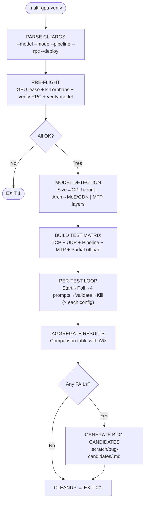
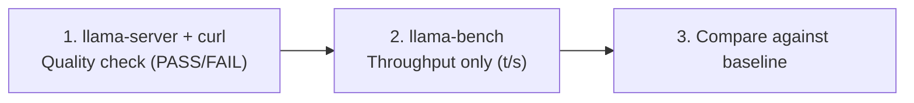

# Multi-GPU Verify

A pampered, hand-holding guide for running multi-GPU model tests. Every detail is spelled out — the agent only needs to adapt if the exact use case doesn't fit the blueprint.

## Quick Start

The executable script at `.scratch/scripts/multi-gpu-verify.sh` implements the full pipeline. Use it directly for standard test runs:

```bash
/home/hunter/scratch/prototype-auto/atomic-llama-cpp-turboquant/.scratch/scripts/multi-gpu-verify.sh \
  --model /mnt/980pro/models/Qwen3-Next-80B-A3B-Instruct-Q5_K_M.gguf \
  --mode all \
  --pipeline on
```

The script handles GPU locks, RPC verification, polling, validation, bug candidate generation, and reporting automatically. The detailed sections below are for reference when customization is needed.

## Complete Pipeline



---

## 1. Model Detection Blueprint

### 1a. Model-to-GPU Mapping

| Model File | Size | GPUs | RPC Endpoints | -ngl | Arch |
|-----------|------|------|---------------|------|------|
| `Qwen3.5-9B-MTP-Q4_K_M.gguf` | 5.5 GiB | 1 (local only) | none | 99 | Dense + MTP |
| `Qwen3.6-35B-A3B-APEX-MTP-I-Quality.gguf` | 22 GiB | 1 (local only) | none | 99 | GDN MoE + MTP |
| `Qwen3-72B-Instruct.IQ4_XS.gguf` | 40 GiB | 2 | `127.0.0.1:50051` | 99 | Dense |
| `Qwen3-Next-80B-A3B-Instruct-Q5_K_M.gguf` | 53 GiB | 3 | `+192.168.8.23:50054` | 99 | MoE |
| `Qwen3.5-122B-A10B-Q4_K_S.gguf` | 70 GiB | 4 | `+192.168.8.23:50055` | **50** (partial) | GDN MoE |
| `Mixtral-8x22B-Instruct-v0.1.IQ4_XS.gguf` | 72 GiB | 4 | all | 99 | MoE |
| `Qwen3-Coder-Next-APEX-I-Quality.gguf` | 47 GiB | 2 | `127.0.0.1:50051` | 99 | Dense |

### 1b. Auto-Detection Rules

```bash
# Size → GPU count (with 1.05× VRAM overhead for buffers, activations, etc.)
SIZE=$(stat -c%s "$MODEL" 2>/dev/null || stat -f%z "$MODEL")
SIZE_GB=$((SIZE / 1073741824))
# Add ~5% overhead for buffers/activations
NEEDS_GB=$((SIZE_GB * 105 / 100))

if [ $NEEDS_GB -lt 22 ]; then GPU_COUNT=1;     # Fits on 1 GPU (9B, 35B)
elif [ $NEEDS_GB -lt 46 ]; then GPU_COUNT=2;   # e.g. 72B IQ4_XS (42 GiB)
elif [ $NEEDS_GB -lt 60 ]; then GPU_COUNT=3;   # e.g. 80B Q5_K_M (56 GiB)
else GPU_COUNT=4; fi                            # e.g. 122B Q4_K_S (74 GiB)

# Architecture detection — prefer gguf-info if available
if command -v gguf-info >/dev/null 2>&1; then
    ARCH=$(gguf-info "$MODEL" 2>/dev/null | grep -i "architecture" | head -1 || echo "")
else
    ARCH=$(strings "$MODEL" | grep -oE 'gated_delta_net|llama|qwen2|moe' | head -1 2>/dev/null || echo "unknown")
fi

# MTP detection
HAS_MTP=$(strings "$MODEL" | grep -c "mtp_head")
```

### 1c. Model Storage Paths

| Location | Purpose |
|----------|---------|
| `/home/hunter/scratch/prototype-auto/*.gguf` | Small models (9B, 35B, 122B) |
| `/mnt/980pro/models/*.gguf` | Large models (72B+, 80B+, Mixtral) |
| `/mnt/toshiba_a/models/*.gguf` | Archive models |
| `/mnt/toshiba_b/models/*.gguf` | Very large models (172B+) |

---

## 2. Pre-Flight Guard (Exact Commands)

### 2a. Acquire GPU Lease

```bash
LEASE_ID="multigpu-$$-$(date +%s)"
mkdir -p /home/hunter/scratch/prototype-auto/atomic-llama-cpp-turboquant/.scratch/leases
cat > /home/hunter/scratch/prototype-auto/atomic-llama-cpp-turboquant/.scratch/leases/${LEASE_ID}.lease <<EOF
agent: multi-gpu-verify
gpus: 0
acquired: $(date -Iseconds)
expires: $(date -Iseconds -d '+120 minutes' 2>/dev/null || echo "+120min")
purpose: multi-GPU verification
EOF

# Cleanup trap
trap "rm -f /home/hunter/scratch/prototype-auto/atomic-llama-cpp-turboquant/.scratch/leases/${LEASE_ID}.lease; kill \$(lsof -t -i:18921-18950) 2>/dev/null" EXIT
```

### 2b. Kill Orphan Servers

```bash
cd /home/hunter/scratch/prototype-auto/atomic-llama-cpp-turboquant
# Kill any leftover llama-server processes on test ports
for port in $(seq 18901 18950); do
    kill $(lsof -t -i:$port) 2>/dev/null || true
done
sleep 2
```

### 2c. Verify RPC Endpoints

```bash
# Standard endpoints for this hardware setup:
RPC_ENDPOINTS=(
    "127.0.0.1:50051"       # Docker 3060 Ti (romulus)
    "192.168.8.23:50054"    # RTX 3090 (triton)
    "192.168.8.23:50055"    # RTX 3070 (triton)
)

for ep in "${RPC_ENDPOINTS[@]}"; do
    if nc -z ${ep/:/ } 2>/dev/null; then
        echo "  $ep: OK"
    else
        echo "  $ep: DOWN — RPC server not running"
        exit 1
    fi
done
```

### 2d. Verify Model File

```bash
if [ ! -f "$MODEL" ]; then
    echo "Model not found: $MODEL"
    exit 1
fi
```

---

## 3. Port Allocation Rules

```yaml
port_ranges:
  regression_tests: 18901-18910   # Used by .scratch/regression-suite.json
  multi_gpu_tests:  18921-18950   # Used by multi-gpu-verify
  per_test_increment: 1           # Each test config gets the next port

# Actual port assignment (increment by +1 per config, NOT +20):
# Port 18921 = config 1 (e.g. TCP)
# Port 18922 = config 2 (e.g. UDP)
# Port 18923 = config 3 (e.g. UDP+Pipeline)
# Port 18924 = config 4 (e.g. MTP)
# Port 18925 = config 5 (e.g. Partial offload)
# ...
```

Port allocation per test config:

```bash
# Generate next available port
NEXT_PORT=18921
while lsof -ti:$NEXT_PORT > /dev/null 2>&1; do
    NEXT_PORT=$((NEXT_PORT + 1))
done
echo "Using port $NEXT_PORT"
```

---

## 4. Build Test Matrix (Exact Configurations)

```bash
# Base server command template
MODEL="/mnt/980pro/models/Qwen3-Next-80B-A3B-Instruct-Q5_K_M.gguf"
RPCS="--rpc 127.0.0.1:50051 --rpc 192.168.8.23:50054 --rpc 192.168.8.23:50055"
NGL=99

# Config 1: TCP baseline
echo "=== Config: TCP ==="
GGML_RPC_UDP=0 ./build-rocm-native/bin/llama-server \
  --model "$MODEL" $RPCS -sm layer -ngl $NGL \
  --no-webui --no-warmup -c 128 --port $PORT \
  > /tmp/multigpu-$LABEL.log 2>&1 &

# Config 2: UDP
echo "=== Config: UDP ==="
GGML_RPC_UDP=1 ./build-rocm-native/bin/llama-server \
  --model "$MODEL" $RPCS -sm layer -ngl $NGL \
  --no-webui --no-warmup -c 128 --port $PORT \
  > /tmp/multigpu-$LABEL.log 2>&1 &

# Config 3: UDP + Pipeline
echo "=== Config: UDP+Pipeline ==="
GGML_RPC_UDP=1 GGML_PIPELINE_PLUS=1 GGML_SCHED_WAVEFRONT_DISPATCH=1 \
  ./build-rocm-native/bin/llama-server \
  --model "$MODEL" $RPCS -sm layer -ngl $NGL \
  --no-webui --no-warmup -c 128 --port $PORT \
  > /tmp/multigpu-$LABEL.log 2>&1 &

# Config 4: MTP
echo "=== Config: MTP ==="
GGML_RPC_UDP=1 ./build-rocm-native/bin/llama-server \
  --model "$MODEL" $RPCS -sm layer -ngl $NGL \
  --no-webui --no-warmup -c 128 --port $PORT \
  --spec-type draft-mtp --spec-draft-n-max 2 \
  > /tmp/multigpu-$LABEL.log 2>&1 &

# Config 5: Partial offload (model too big for -ngl 99)
echo "=== Config: Partial offload -ngl 50 ==="
GGML_RPC_UDP=0 ./build-rocm-native/bin/llama-server \
  --model "$MODEL" $RPCS -sm layer -ngl 50 \
  --no-webui --no-warmup -c 64 --port $PORT \
  > /tmp/multigpu-$LABEL.log 2>&1 &
```

---

## 5. Per-Test Execution Loop (Exact Steps)

### 5a. Start Server + Poll for Readiness

```bash
start_server_and_wait() {
    local PORT=$1 LABEL=$2 ENV_VARS=$3
    shift 3

    # Start server
    eval "$ENV_VARS ./build-rocm-native/bin/llama-server \
      --model \"$MODEL\" $RPCS -sm layer -ngl $NGL \
      --no-webui --no-warmup -c 128 --port $PORT \
      $MTP_FLAGS > /tmp/multigpu-$LABEL.log 2>&1 &"
    SERVER_PID=$!

    # Poll for readiness (up to 180s, 5s intervals — 122B models can take 130s)
    echo "Waiting for server on port $PORT..."
    READY=false
    for i in $(seq 1 36); do
        sleep 5
        if curl -sf --max-time 3 http://127.0.0.1:$PORT/v1/completions > /dev/null 2>&1; then
            READY=true
            echo "Server ready after $((i * 5))s"
            break
        fi
    done

    if [ "$READY" = false ]; then
        echo "TIMEOUT — server not ready after 180s"
        echo "Server log tail:"
        tail -20 /tmp/multigpu-$LABEL.log
        kill $SERVER_PID 2>/dev/null || true
        return 1
    fi
    return 0
}
```

### 5b. Run 4 Validation Prompts

```bash
run_prompts() {
    local PORT=$1
    local PROMPTS=(
        "2+2="
        "The capital of France is"
        "Hello world"
        "What is machine learning?"
    )

    for prompt in "${PROMPTS[@]}"; do
        echo "=== Prompt: $prompt ==="

        # Check server is still alive BEFORE curl
        if ! kill -0 $SERVER_PID 2>/dev/null; then
            echo "SERVER DIED before prompt — aborting"
            tail -5 /tmp/multigpu-$LABEL.log
            break
        fi

        curl -s --max-time 60 http://127.0.0.1:$PORT/v1/completions \
          -H "Content-Type: application/json" \
          -d "{\"prompt\":\"$prompt\",\"max_tokens\":32,\"temperature\":0}" \
          | python3 /tmp/checker.py

        # Check server still alive AFTER curl
        if ! kill -0 $SERVER_PID 2>/dev/null; then
            echo "SERVER DIED after prompt"
            tail -5 /tmp/multigpu-$LABEL.log
            break
        fi
    done
}
```

### 5c. Python Checker Script

Save to `/tmp/checker.py`:

```python
#!/usr/bin/env python3
import sys, json, re

try:
    r = json.load(sys.stdin)

    # Extract text and timings
    t = r['choices'][0]['text']
    ts = r.get('timings', {})
    tg = ts.get('predicted_per_second', 0)
    pp = ts.get('prompt_per_second', 0)

    # Check 1: Chinese characters (U+4E00 to U+9FFF = CJK Unified Ideographs)
    chinese = any(ord(c) > 0x4e00 and ord(c) < 0x9fff for c in t)

    # Check 2: Garbage bytes (U+FFFD = replacement char, 0x00-0x1F = control chars except tab/newline)
    garbage = bool(re.search(r'[\ufffd\u0000-\u0008\u000b\u000c\u000e-\u001f]', t))

    # Check 3: Repetition loops (4+ same consecutive words)
    words = t.split()
    repeats = sum(1 for i in range(4, len(words))
                  if len(words) > i and words[i] == words[i-1] == words[i-2] == words[i-3])

    # Check 4: Empty output (model returned 0 tokens)
    empty = len(t.strip()) == 0

    # Output
    status = "FAIL" if (chinese or garbage or repeats > 0 or empty) else "PASS"
    print(f'tg={tg:.1f} pp={pp:.1f} chinese={chinese} garbage={garbage} repeats={repeats} status={status}')
    print(f'text={repr(t[:120])}')

except json.JSONDecodeError:
    print('ERROR: Invalid JSON response (server may have crashed)')
    print('FAIL')
except KeyError as e:
    print(f'ERROR: Missing key {e} in response')
    print('FAIL')
except Exception as e:
    print(f'ERROR: {e}')
    print('FAIL')
```

### 5d. Kill Server

```bash
cleanup_server() {
    local PID=$1
    kill $PID 2>/dev/null
    wait $PID 2>/dev/null || true
    sleep 2
}
```

---

## 6. Bug Candidate Generation (🆕)

### 6a. When to Generate

A bug candidate is generated when ANY prompt in ANY test config produces:
- Chinese characters in the output, OR
- Garbage bytes (U+FFFD or control chars), OR
- Repetition loops (4+ same consecutive words), OR
- Server crash (SIGSEGV, assertion failure), OR
- RPC disconnect (`ggml-rpc.cpp:*: Remote RPC server crashed`), OR
- OOM (`cudaMalloc failed: out of memory`)

### 6b. Severity Auto-Classification

| Failure Pattern | Auto-Severity | Config Error Likelihood | Reasoning |
|----------------|---------------|------------------------|-----------|
| Garbage bytes (U+FFFD) | 🔴 Critical | Low | Always a code bug (memory corruption) |
| Crash / SIGSEGV | 🔴 Critical | Low | Always a code bug |
| RPC disconnect | 🔴 Critical | Low | Code or network bug, never config |
| Chinese characters | 🟠 High | Medium | Could be base-model behavior (FIX-008) |
| Repetition loops | 🟠 High | Medium | Could be sampling params |
| OOM | 🟡 Medium | High | Try -ngl lower or partial offload |
| Timeout (server not ready) | 🟡 Medium | High | Model too large, port conflict, or RPC down |

### 6c. Bug Candidate File Template

Write to `.scratch/bug-candidates/candidate-NNN-<short-desc>.md`:

```markdown
### BUG-CANDIDATE-NNN: Auto-detected: <symptom summary>

| Field | Value |
|-------|-------|
| **Severity** | <auto-classified> |
| **Discovered** | 2026-07-27 |
| **Affected models** | `<model path>` |
| **Trigger** | `<test config that failed>` |
| **Reproduction** | `<exact command — see note below>` |
| **Hardware** | `<GPU list with VRAM>` |
| **Symptom** | `<exact failure output, first 500 chars>` |
| **Root cause** | _Not yet diagnosed_ |
| **Workaround** | `<if applicable, e.g. "Use -ngl 50">` |
| **Status** | 🟡 **Candidate** — needs user review |
| **Test evidence** | Full log: `/tmp/multigpu-<config>.log` |

> **Note:** When using the executable script (`.scratch/scripts/multi-gpu-verify.sh`),
> all `<placeholder>` values above are automatically filled with real values from
> the test run (`$MODEL`, `$PORT`, `$ENV_VARS`, `$RPC_ENDPOINTS`, etc.).

---

> Auto-generated by multi-gpu-verify on 2026-07-27.
> Review before importing into BUGS.md. This may be a config error
> (wrong -ngl, port conflict) rather than a code bug.
> If real bug: copy/paste into BUGS.md and change Status to `🔴 **Open**`.
> If config error: delete this file (`rm .scratch/bug-candidates/<file>`).
```

### 6d. Storage

```bash
mkdir -p /home/hunter/scratch/prototype-auto/.scratch/bug-candidates/
# Count existing candidates to generate unique ID
CANDIDATE_NUM=$(ls /home/hunter/scratch/prototype-auto/.scratch/bug-candidates/ 2>/dev/null | wc -l)
CANDIDATE_NUM=$((CANDIDATE_NUM + 1))
CANDIDATE_FILE="/home/hunter/scratch/prototype-auto/.scratch/bug-candidates/candidate-$(printf '%03d' $CANDIDATE_NUM)-$(date +%Y-%m-%d)-$(echo $SHORT_DESC | tr ' ' '-').md"
```

### 6e. Never Auto-Import

The skill **never** writes to BUGS.md directly. Bug candidates go into `.scratch/bug-candidates/`. The user reviews them later and decides which are real bugs vs config errors.

---

## 7. Aggregation + Report

### 7a. Build Comparison Table

```python
# After all tests complete, aggregate into this format:
report = """
| Config | tg t/s | vs TCP | Chinese | Garbage | Repeats | Verdict |
|--------|--------|--------|---------|---------|---------|---------|
| TCP    | {tcp_tg:.1f} | —      | {tcp_cn}    | {tcp_gb}    | {tcp_rp}    | {tcp_result} |
| UDP    | {udp_tg:.1f} | +{delta:.0f}% | {udp_cn}    | {udp_gb}    | {udp_rp}    | {udp_result} |
"""
```

### 7b. Report Format

Write to `--output` (default: `/tmp/multigpu-<date>.md`):

```markdown
# Multi-GPU Verify Report

**Date:** 2026-07-27
**Model:** <path>
**Build:** <commit hash>

## Hardware
| Node | GPU | VRAM | Backend | Role |
|------|-----|------|---------|------|
| romulus | RX 7900 XTX | 24 GiB | ROCm | Primary |
| romulus (Docker) | RTX 3060 Ti | 8 GiB | CUDA | RPC :50051 |
| triton | RTX 3090 | 24 GiB | CUDA | RPC :50054 |
| triton | RTX 3070 | 8 GiB | CUDA | RPC :50055 |

## Results
| Config | tg t/s | vs TCP | Chinese | Garbage | Repeats | Verdict |
|--------|--------|--------|---------|---------|---------|---------|
| TCP    | 15.4   | —      | ✅      | ✅      | ✅      | PASS    |
| UDP    | 24.4   | +58%   | ✅      | ✅      | ✅      | PASS    |

## Bug Candidates
- <link to each candidate file generated>

## Verdict
**PASS** — all configs produced coherent output
**FAIL** — <N> config(s) failed, <N> bug candidate(s) generated
```

---

## 8. Deploy RPC Server to Remote Nodes (Optional)

```bash
deploy_rpc_server() {
    local BUILD_DIR="/home/hunter/scratch/prototype-auto/atomic-llama-cpp-turboquant/build-cuda-b-bin"

    # Build CUDA rpc-server
    cmake --build "$BUILD_DIR" --target all -j$(nproc) 2>&1 | tail -5

    # Deploy to triton
    ssh hunter@192.168.8.23 "sudo kill \$(pgrep rpc-server) 2>/dev/null; sleep 2"
    scp "$BUILD_DIR/bin/rpc-server" hunter@192.168.8.23:/tmp/rpc-server-new

    # Restart on triton (3090:50054, 3070:50055)
    ssh hunter@192.168.8.23 "
        sudo cp /tmp/rpc-server-new /usr/local/bin/rpc-server && \
        sudo LD_LIBRARY_PATH=/usr/local/cuda-12.8/lib64 \
            nohup /usr/local/bin/rpc-server -H 0.0.0.0 -p 50054 -d CUDA0 > /tmp/rpc-50054.log 2>&1 & \
        sleep 3 && \
        sudo LD_LIBRARY_PATH=/usr/local/cuda-12.8/lib64 \
            nohup /usr/local/bin/rpc-server -H 0.0.0.0 -p 50055 -d CUDA0 > /tmp/rpc-50055.log 2>&1 & \
        sleep 3 && \
        pgrep rpc-server | wc -l
    "
}
```

---

## 9. Usage Examples (Runnable)

```bash
# === Example 1: Quick 80B MoE test (most common case) ===
multi-gpu-verify \
  --model /mnt/980pro/models/Qwen3-Next-80B-A3B-Instruct-Q5_K_M.gguf \
  --mode all \
  --pipeline on

# === Example 2: 72B dense, UDP only ===
multi-gpu-verify \
  --model /mnt/980pro/models/Qwen3-72B-Instruct.IQ4_XS.gguf \
  --mode udp

# === Example 3: 122B GDN with partial offload ===
multi-gpu-verify \
  --model /home/hunter/scratch/prototype-auto/Qwen3.5-122B-A10B-Q4_K_S.gguf \
  --mode tcp \
  --ngl 50

# === Example 4: Full regression run after bug fixes ===
multi-gpu-verify --model /mnt/980pro/models/Qwen3-Next-80B-A3B-Instruct-Q5_K_M.gguf --mode all --pipeline on
multi-gpu-verify --model /mnt/980pro/models/Qwen3-72B-Instruct.IQ4_XS.gguf --mode udp
multi-gpu-verify --model /home/hunter/scratch/prototype-auto/Qwen3.6-35B-A3B-APEX-MTP-I-Quality.gguf --mode all

# === Example 5: Deploy updated rpc-server first, then test ===
multi-gpu-verify \
  --model /mnt/980pro/models/Qwen3-Next-80B-A3B-Instruct-Q5_K_M.gguf \
  --deploy \
  --mode all
```

---

## 10. Executable Script

The full pipeline is implemented as an executable script at:

```
/home/hunter/scratch/prototype-auto/atomic-llama-cpp-turboquant/.scratch/scripts/multi-gpu-verify.sh
```

Run it directly:

```bash
# Make executable (first time only)
chmod +x /home/hunter/scratch/prototype-auto/atomic-llama-cpp-turboquant/.scratch/scripts/multi-gpu-verify.sh

# Quick test
/home/hunter/scratch/prototype-auto/atomic-llama-cpp-turboquant/.scratch/scripts/multi-gpu-verify.sh --help

# Test a model
/home/hunter/scratch/prototype-auto/atomic-llama-cpp-turboquant/.scratch/scripts/multi-gpu-verify.sh \
  --model /mnt/980pro/models/Qwen3-Next-80B-A3B-Instruct-Q5_K_M.gguf \
  --mode all --pipeline on
```

The script implements everything in this skill:
- Real GPU lock via atomic `mkdir` (not documentary-only)
- VRAM overhead calculation (1.05×)
- Polling up to 180s (handles 122B models)
- Server-alive check before and after each prompt
- Empty output check (4th validation criterion)
- Bug candidate generation with severity auto-classification
- Delta% calculation against TCP baseline
- Guaranteed cleanup via trap on EXIT/INT/TERM

---

## Tool Preference Rules

### ✅ Always Prefer: `llama-server`

All correctness tests in this skill use `llama-server` + `curl`. This is the only reliable way to test model output quality.

### ❌ Avoid: `llama-cli`

`llama-cli` produces a spinner animation and `>` continuation prompts that **hang indefinitely** when output garbled or when piped to automated tools. An agent can waste 5+ minutes waiting for `llama-cli` to finish a garbled generation before timing out and killing it.

**If an agent or script uses `llama-cli` by mistake:**
```bash
# Kill it immediately — don't wait for it to finish
pkill -f "llama-cli" 2>/dev/null

# Re-run with llama-server instead
```

This is not a hard block (legitimate use cases exist for interactive testing), but **never use `llama-cli` in automated scripts or test pipelines.**

### ⚠️ Limited: `llama-bench`

For **pure throughput measurement** (no quality checks), `llama-bench` is faster than `llama-server` + `curl` because it skips HTTP overhead:

```bash
./build-rocm-native/bin/llama-bench \
  --model /mnt/980pro/models/Qwen3-Next-80B-A3B-Instruct-Q5_K_M.gguf \
  -ngl 99 -t 8 -p 512 -n 128
```

**But `llama-bench` does NOT check for:**
- Chinese characters in output
- Garbage bytes
- Repetition loops
- Empty output
- Any correctness at all

Use `llama-bench` only when you already know the model produces correct output (verified by `llama-server` first). The workflow is:



### Quick Reference

| Tool | Quality Check | Throughput | Use When |
|------|:------------:|:----------:|----------|
| `llama-server` + `curl` | ✅ Full (Chinese/garbage/repeats/empty) | ✅ Included in timings | **Default — always use this** |
| `llama-bench` | ❌ None | ✅ Fast, no HTTP overhead | After quality verified, for perf baselines |
| `llama-cli` | ❌ Hangs on garbled | ❌ Spinner loop | ❌ **Avoid in automation** |

---

## Key Design Decisions

| Decision | Rationale |
|----------|-----------|
| **Bug candidates in `.scratch/bug-candidates/`** | Never auto-imports into BUGS.md — user reviews first. Distinguishes real bugs from config errors. |
| **Severity auto-classification** | Garbage bytes = 🔴 Critical (always a code bug). OOM = 🟡 Medium (might be wrong -ngl). |
| **4 fixed prompts** | Arithmetic, geography, greeting, explanation — each exercises different model capabilities. |
| **max_tokens=32** (was 8) | 8 tokens missed repetition patterns and produced too-short output for quality checks. 32 gives enough context for meaningful validation. |
| **Polling loop instead of sleep** | 180s with 5s intervals adapts to variable load times (35B=8s, 122B=130s+). |
| **Unique ports per test config** | Prevents port conflicts between sequential tests (TIME_WAIT state). |
| **Server-alive check before AND after each prompt** | Detects mid-test crashes — partial results don't masquerade as complete passes. |
| **curl exit code parsing** | Differentiates "server crashed" (exit 52) from "network down" (exit 7) from "timeout" (exit 28). |
| **Empty output check (4th validation criterion)** | A model that loads but produces 0 tokens is still a failure. |
| **Real GPU lock via atomic mkdir** | Prevents two agents from racing on the same GPU (lease files alone are documentary). |
| **VRAM overhead factor (1.05×)** | Models need ~5% extra VRAM for buffers, activations, and scratch space beyond the file size. |
| **Disk space pre-flight** | Checks `/tmp` has ≥500 MB free before starting — prevents silent log write failures. |
| **MTP draft acceptance parsing** | Reads server log for "accepted"/"rejected" lines to verify MTP is actually speculating. |
| **CPU offload ratio logging** | Logs how many layers were offloaded to GPU, so CPU-fallback slowdowns are visible. |
| **Binary freshness check** | Logs binary mtime so the user can verify the build matches the source. |
| **No auto-write to BUGS.md** | Staging area prevents noise from config errors polluting the bug ledger. |
